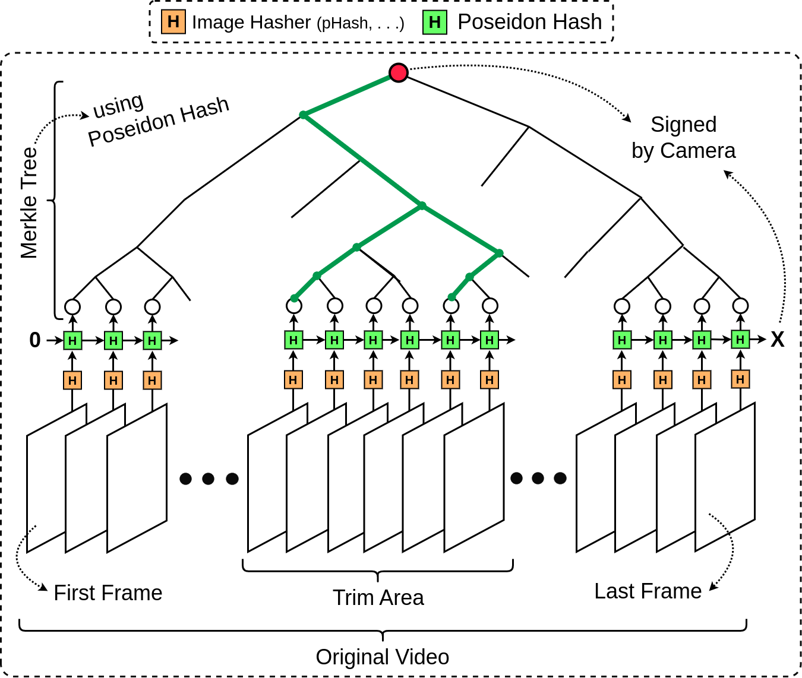

# proven-view
")

# Details
**_ProvenView_** handles all of the necessary steps described in this section so that you can easily _commit_ to an original video and later prove authenticity of a trimmed/refined version of it accordingly without any problem. You do not need to know or understand any of the following details before using **_ProvenView_** 😎😉.

## 1) Commitment
The general idea is to somehow commit to a picture. We assume that the image source is "_trusted_".
This means that the original video is captured by a verified camera. 

> [!NOTE]
> Depending on the application, this trusted source can have different implementations.
> Some applications (e.g., news industry) may require use of specific digital cameras, such as Sony's C2PA-compatible Alpha 9 III. On the other hand, there are certain scenarios in which a mobile application (e.g., TruePic) can also be assumed a trusted source.
> We acknowledge that in either scenarios, **_ProvenView_** can be used, simply because there are no restrictions on the method of capture, while using **_ProvenView_**.

To achieve this, the first thing is to "_commit_" to the original source. **Figure 1** provide geenral overview of the proposed commitment scheme to a video.
In the proposed scheme, the camera (whether it is a C2PA-compatible DSLR or a mobile phone application) creates the presented Merkle tree in **Figure 1** by executing following steps:
1. **Calculate hash of each individual frame**: For this step, we employ standard image hashing algorithms ([Library](https://github.com/JohannesBuchner/imagehash)), such [pHash](https://www.hackerfactor.com/blog/index.php?/archives/432-Looks-Like-It.html) or [aHash](https://www.hackerfactor.com/blog/index.php?/archives/432-Looks-Like-It.html) that are significantly faster than secure cryptographic hash algorithms like SHA3 or Pseidon. Note that we cannot expect any recording device to crazily calculate a SHA3 hash of every frame in a video. To give you an insight, the amount of SHA3 hashes required for low resolution (SD) video with the length of only 2 minutes and a frame rate of only 30 FPS, exeeds 100 Million hashes 💀🙃.
2. **Calculate Continous hashes of frames**: We want to make sure that the sequnece of frames is indeed unique and not malformed. So, we need to "_chain_" the frames together, just like what we have in any blockchain structure 🙂.
3. **Calculate Merkle tree**: In order to "_prove_" that we have trimmed a part of an original video, we need to prove two things:
    1) The _end_ and _start_ frames of the trimmed version are from the original video.
    2) All of the frames between the start and end frames are kept as they were (the sequence of the frames is not changed in any way, and the contents of frames didn't change).

      While the second statement in the above can be proven by calculating the continuous hash of the frames, the first statement requires the ability of proving inclusion of any two frames in the original video. To achieve this, we generate a Merkle tree from the hash values of all the frames during the commitment. The Merkle root is then signed by the _Camera_. Now, it is possible to prove that the start and end frames of the trimmed video actually belong to the original video by providing two Merkle proofs one for each 😃.
4. **Signature generation**: The camera signs The Merkle root calculated in the step 3. 
This signature will act as the final commitment to the video.

<b>Figure 1</b>: Overview of the commitment scheme for a captured video. 

## 2) Prove
One of the advantages of using the standard image hash algorithms, such as [pHash](https://www.hackerfactor.com/blog/index.php?/archives/432-Looks-Like-It.html) or [aHash](https://www.hackerfactor.com/blog/index.php?/archives/432-Looks-Like-It.html), is the fact that resizing the frames should not have any effect on the hash. This is because of the squeezing step in the image hash algorithms in general. This is an interesting outcome because we simply can prove authenticity of the trimmed version of the video from any size (SD, HD, FHD,. . . .) using the same commitment from the original video. proving is pretty straight-forward and consists of the following steps:
1. **prove authenticity of the start frame**: Merkle proof stating that you know the oppeing (a frame and the previous comulicative hash of this frame) of a leaf in the Merkle tree.
2. **prove integrity of the trimmed video**: Prove that you know all of the frames within the path of going from the start frame to the final frame, by commulicatively calculating their hashes.
3. **prove authenticity of the final frame**: Merkle proof stating that you know the oppeing (whcih is equal to the final hash you calculated in the previous step) of a leaf in the Merkle tree. 
