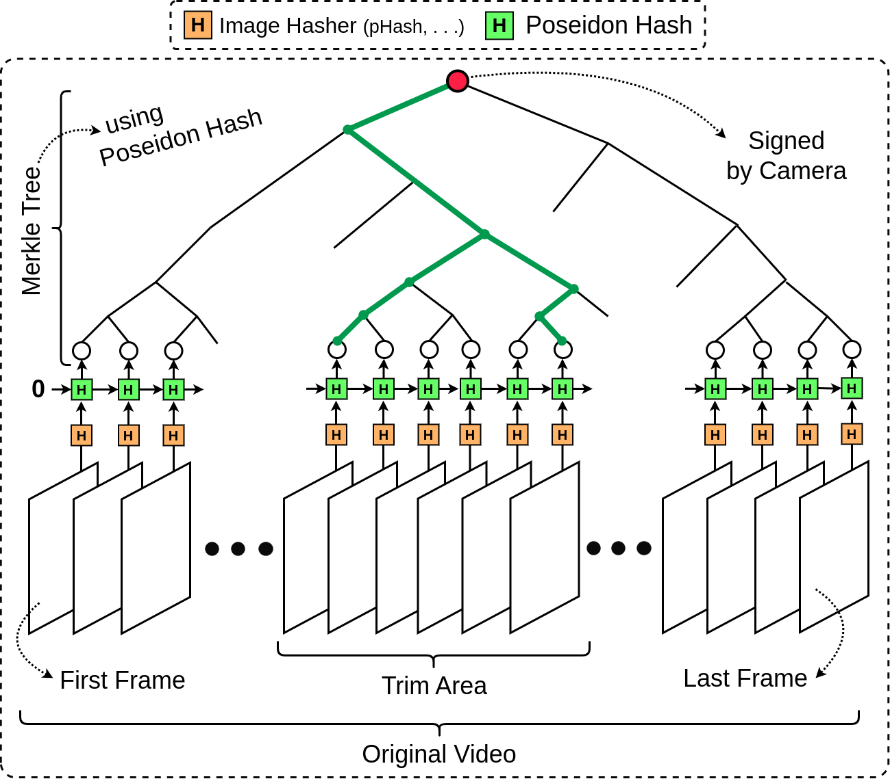

# proven-view
Verifiable video trimming/editing software using Folding-based zkSNARKs

# Details
The general idea is to somehow commit to a picture. We assume that the image source is "_trusted_".
This means that the original video is captured by a verified camera. 

> [!NOTE]
> Depending on the application, this trusted source can have different implementations.
> Some applications (e.g., news industry) may require use of specific digital cameras, such as Sony's C2PA-compatible Alpha 9 III. On the other hand, there are certain scenarios in which a mobile application (e.g., TruePic) can also be assumed a trusted source.
> We acknowledge that in either scenarios, **_ProvenView_** can be used, simply because there are no restrictions on the method of capture, while using **_ProvenView_**.

To achieve this, the first thing is to "_commit_" to the original source. **Figure 1** provide geenral overview of the proposed commitment scheme to a video.
In the proposed scheme, the camera (whether it is a C2PA-compatible DSLR or a mobile phone application) creates the presented Merkle tree in **Figure 1** by executing following steps:
1. **Calculate hash of each individual frame**: For this step, we employ standard image hashing algorithms ([Library](https://github.com/JohannesBuchner/imagehash)), such [pHash](https://www.hackerfactor.com/blog/index.php?/archives/432-Looks-Like-It.html) or [aHash](https://www.hackerfactor.com/blog/index.php?/archives/432-Looks-Like-It.html) that are significantly faster than secure cryptographic hash algorithms like SHA3 or Pseidon. Note that we cannot expect any recording device to crazily calculate a SHA3 hash of every frame in a video. To give you an insight, the amount of SHA3 hashes required for low resolution (SD) video with the length of only 2 minutes and a frame rate of only 30 FPS, exeeds 100 Million hashes 💀🙃.
2. **Calculate Continous hashes of frames**: We want to make sure that the sequnece of frames is indeed unique and not malformed. So, we need to "_chain_" the frames together, just like what we have in any blockchain structure 🙂. The last hash result is unique to the original video and will be signed by the Camera.
3. **Calculate Merkle tree**: In order to "_prove_" that we have trimmed a part of an original video, we . . . .

 <b>Figure 1</b>: Overview of the commitment scheme for a captured video. 

